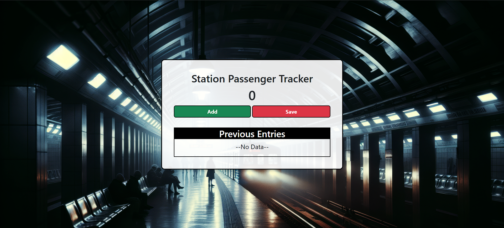
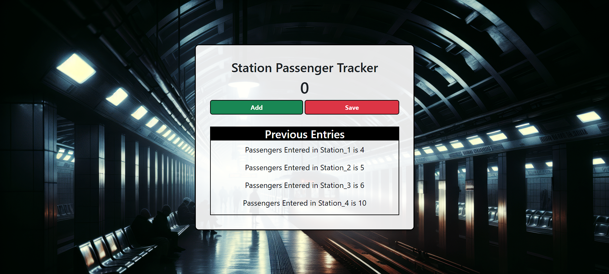

# Station Passenger Tracker

A simple web app to count and track the number of passengers entering train stations. The app provides an easy way to log station-wise entries.

## Features
- **Add Counter**: Increment the passenger count.
- **Save Entries**: Save the current count and reset it for the next station.
- **Previous Entries Display**: View all saved entries in a list.
- **Dynamic "No Data" Message**: Displays "No Data" when no entries are available and hides it when data is saved.

## Tech Stack
- **HTML5**: For the app structure.
- **CSS3**: For styling, including a modern card layout and background image.
- **Bootstrap 5**: For responsive buttons and layout.
- **JavaScript**: For core functionality such as adding and saving counts.

## How to Run
1. Clone the repository:
   ```bash
   git clone https://github.com/your-username/station-passenger-tracker.git
2. Navigate to the project directory:
   ```bash
   cd station-passenger-tracker
3. Open index.html in your browser.

## Usage Instructions
1. Increment Count: Click the green "Add" button to increase the passenger count.
2. Save Entry: Click the red "Save" button to save the current count. This will:
- Add the entry to the "Previous Entries" list.
- Reset the counter to 0.
- Remove the "No Data" message if it's visible.
3. View Entries: Check the "Previous Entries" section to see all saved counts.
  
## File Structure
- **index.html**: The main HTML file for the app.
- **style.css**: Custom CSS for the layout and design.
- **script.js**: JavaScript logic for interactivity.
- **assest/**: Contains the background image used in the app.

## Preview



## Future Enhancements
- Add the ability to delete or edit saved entries.
- Implement local storage or database integration to persist data.
- Improve responsiveness for mobile devices.

## Contributing
Contributions are welcome! Feel free to open an issue or submit a pull request.

##Contact
Created by [Yogesh](https://github.com/Yoki-28) - feel free to reach out!
